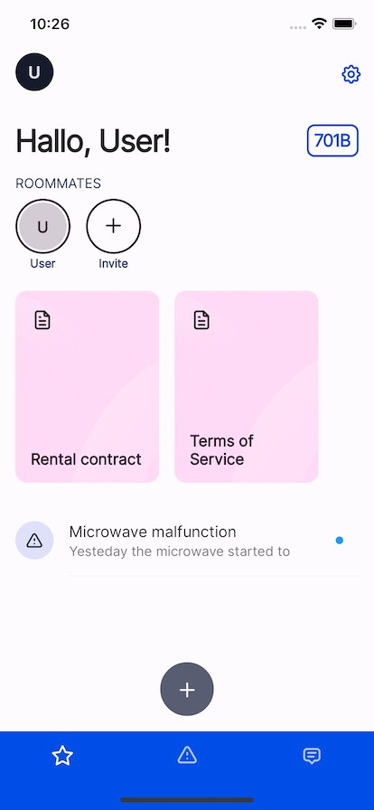

# Hausmeister
Mobile app for janitors, landlords, hausmeisters and administrators looking for a custom solution on customer relationship service



### Features
- Tenant onboard with access codes
- Document sharing
- Roommate invitation
- Ticket system
- Realtime chat
- User profiles


### Next steps
- Complete overhaul for the user interface
- Automatically charge your monthly rental fee with Stripe
- Customize user experience with new functionalities
- Offer goods and services through a online shop

### Development

Build container
`docker-compose build --build-arg EMULATOR_HOST=localhost`

Start container
`docker-compose up`

Run app
`flutter run --dart-define=EMULATOR_HOST=0.0.0.0`

Setup Firebase
```bash
firebase init
cd app && flutterfire configure
```
